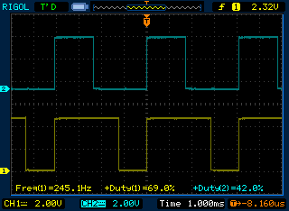
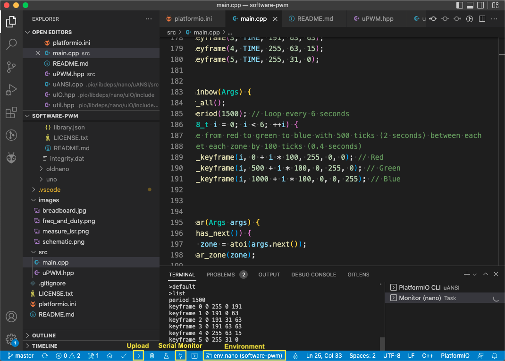
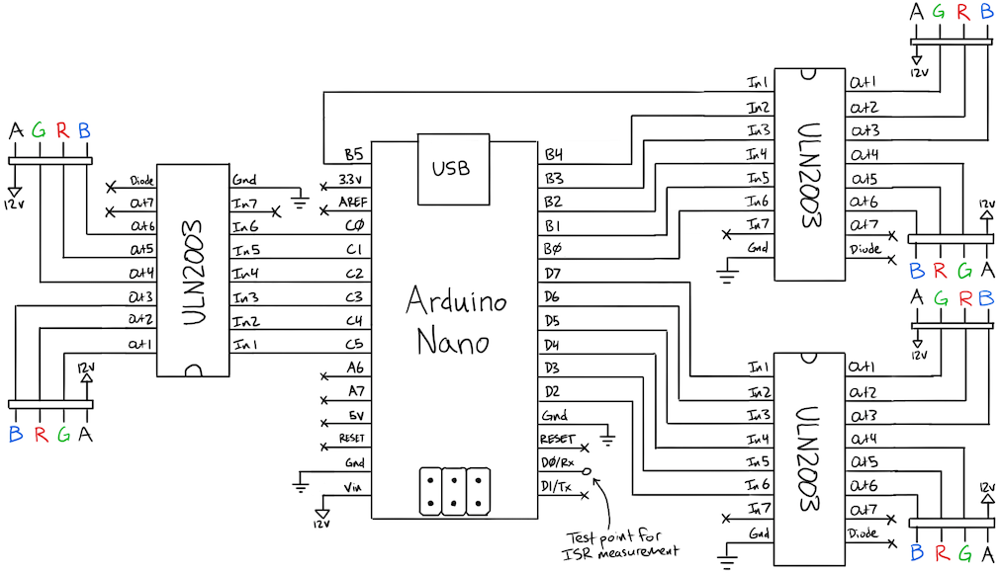
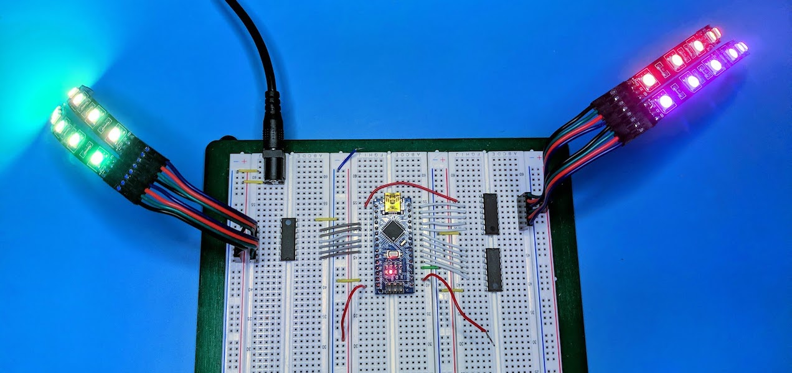
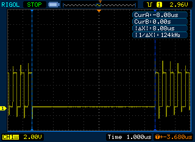

# ATmega328p 6-strip RGB LED controller

- Control several independent strips of dumb LEDs; not for addressable smart LEDs like WS2811
- Use every GPIO pin for interrupt-driven 8-bit PWM
- Keyframe animation using linear interpolation



The built-in hardware [PWM](https://en.wikipedia.org/wiki/Pulse-width_modulation) feature of AVR microcontrollers allows certain GPIO pins to be pulsed by a hardware timer, approximating an analog signal proportional to how long a pin is held high or low (duty cycle). After the duty cycle is configured by software (the `analogWrite` function from the Arduino API), the timer will continually pulse the pin independent of other CPU activity. The ATmega328p (Arduino Nano/Uno) has 3 timers that can generate 2 PWM outputs each, for a total of 6: enough to drive 2 strips of RGB LEDs. But what about the other 12 GPIO pins?

The AVR timer units can also be configured to call an interrupt function after a programmable delay. When the timer is ready, whatever code is running will pause and the CPU will jump to the interrupt function, resuming the previous code after the function returns. The Arduino library uses this feature to keep track of time for the `millis` function. Operating systems on desktop computers use similar timers to switch between software threads.

By keeping a list of all GPIO pins, sorted by the desired duty cycle, we can set the timer so it continually wakes up when the next pin(s) needs to change state and then reprogram itself for the next pin after that. Once this is configured, it will run fully in the background, transparent to whatever code is running in the microcontroller loop. With 18 free GPIO pins (reserving D0/D1 for serial Tx/Rx), our Arduino Nano/Uno can now drive 6 fully independent strings of RGB lights.

## Building the example program

Use the [PlatformIO](https://platformio.org/) plugin for [VSCode](https://code.visualstudio.com/).

Open the project folder with VSCode, select the environment for your board (`uno`, `nano`, `oldnano`), and click `Upload`.



The [core](https://github.com/trevor-makes/core) library is required and PlatformIO will download this into the `.pio` folder.

Distributed under the [MIT license](LICENSE.txt)

## Assembling the example circuit

ULN2003 Darlington transistor arrays are used for driving common anode LED strips. When an input pin is set high by the Arduino, the corresponding output pin becomes a low resistance path to ground (open collector) which allows current to flow from the 12 V power supply through the LEDs and ULN2003 but _not_ through the Arduino. Other types of LEDs or loads may require different drivers, amplifiers, or relays.





## Using the example program

After building and uploading the program to the Arduino, connect a serial monitor such as the one included with PlatformIO. A '>' should appear as a prompt for input. The following commands are available:

```
>keyframe zone time red green blue
```
Add an RGB keyframe to `zone` at the specified `time` (250 ticks = 1 second). A single keyframe will display a fixed color, while multiple keyframes will interpolate over time to display a gradient.

```
>keyframe 0 500 255 127 63
```
Sets the first zone (0) to 100% (255) red, 50% (127) green, 25% (63) blue at 2 seconds (500 ticks) from the start of the loop.

```
>period time
```
Set the animation to loop over `time` ticks (250 ticks = 1 second).

```
>clear (zone)
```
Clear all keyframes from the given `zone`, or clear all zones if none given.

```
>list
```
Prints `period` and `keyframe` commands currently in use. These can be copy-pasted and re-sent to recreate the current animation.

```
>save (index)
```
Saves the current animation to EEPROM at `index` (0 if omitted). Prints an error if the index is out of bounds. At startup, the animation at index 0 (if it exists) will be loaded automatically. With the default `uPWM::Controller` configuration, indices 0 through 3 can be used.

```
>load (index)
```
Loads a saved animation from EEPROM at `index` (0 if omitted). Prints an error if the index is out of bounds or if the data in EEPROM is invalid.

```
>measure (pwm|micros|both)
```
Freezes the animation and command input while generating a square wave on the `Rx` pin. Timer interrupts will continue to run and can be observed with an oscilloscope or logic analyzer where the square wave is jammed high or low. Refer to the source code for instructions on measuring ISR duration.



## Using PWM in another project

Software PWM, low-level GPIO, and CLI features are provided by the [core](https://github.com/trevor-makes/core) library. To add `core` to a PlatformIO project, modify the `platformio.ini` configuration file as follows:

```
lib_deps =
    ...other dependencies...
    https://github.com/trevor-makes/core.git
```

Create an alias for the desired GPIO pins using `core/io`. This enables fast parallel I/O with AVR's OUT instruction, up to hundreds of times faster than Arduino `digitalWrite` calls. Here we extend ports B, C, and D into a single 24-bit virtual port:
```
#include "core/io.hpp"

// Create Port wrappers for PORTx, DDRx, PINx registers
CORE_PORT(B)
CORE_PORT(C)
CORE_PORT(D)

// D2 through D7 (0 and 1 used for serial Rx/Tx)
// C0 through C5 (6 used for RESET, 7 doesn't exist)
// B0 through B5 (6 and 7 used for clock crystal)
// [x x x x x x x x | D7 D6 D5 D4 D3 D2 x x | x x C5 C4 C3 C2 C1 C0 | x x B5 B4 B3 B2 B1 B0]
using PWMPins = core::WordExtend<PortD::Mask<0xFC>, PortC::Mask<0x3F>, PortB::Mask<0x3F>>;
```

Define a static interface for the timer providing interrupts. Consult the AVR [datasheet](https://ww1.microchip.com/downloads/en/DeviceDoc/Atmel-7810-Automotive-Microcontrollers-ATmega328P_Datasheet.pdf) or a tutorial like [this](https://raw.githubusercontent.com/abcminiuser/avr-tutorials/master/Timers/Output/Timers.pdf) for instructions on AVR timers. The example program uses "Clear Timer on Compare Match" (CTC) mode on Timer 2. Whichever timer is used, Controller just requires a `set_delay` method to request an interrupt after `delay` ticks:
```
struct PWMTimer {
...
  static void set_delay(uint8_t delay) {
    // Program the timer to interrupt after `delay` ticks
  }
...
};
```

Create an instance of `core::pwm::Controller`. Here we configure it for 6 strips of RGB lights with up to 8 keyframes each:
```
#inclue "core/pwm.hpp"

constexpr const uint8_t N_ZONES = 6; // 6 independent strips
constexpr const uint8_t N_PER_ZONE = 3; // [red, green, blue] per zone
constexpr const uint8_t N_KEYFRAMES = 8; // maximum keyframes per zone
core::pwm::Controller<PWMPins, PWMTimer, N_ZONES, N_PER_ZONE, N_KEYFRAMES> pwm;
```

Hook the Controller's ISR into the relevant timer interrupt:
```
ISR(TIMER2_COMPA_vect) {
  pwm.isr();
}
```

In the `setup` function, define the mapping from zone/color to the pinout of the GPIO port:
```
//     7  6  5  4  3  2  1  0
// B [ -  - g3 r3 b3 g4 r4 b4]
// C [ -  - g0 r0 b0 g1 r1 b1]
// D [g2 r2 b2 g5 r5 b5  -  -]
constexpr auto B = 0, C = 8, D = 16;
pwm.config_pins(0, C + 4, C + 5, C + 3); // r0, g0, b0
pwm.config_pins(1, C + 1, C + 2, C + 0); // r1, g1, b1
pwm.config_pins(2, D + 6, D + 7, D + 5); // r2, g2, b2
pwm.config_pins(3, B + 4, B + 5, B + 3); // r3, g3, b3
pwm.config_pins(4, B + 1, B + 2, B + 0); // r4, g4, b4
pwm.config_pins(5, D + 3, D + 4, D + 2); // r5, g5, b5
```

Use `clear_all`, `set_period`, and `set_keyframe` to initialize the keyframe animation:
```
pwm.clear_all();
pwm.set_period(1500); // Loop every 6 seconds
for (uint8_t i = 0; i < 6; ++i) {
  // Cycle from red to green to blue with 500 ticks (2 seconds) between each
  // Offset each zone by 100 ticks (0.4 seconds)
  pwm.set_keyframe(i, 0 + i * 100, 255, 0, 0); // Red
  pwm.set_keyframe(i, 500 + i * 100, 0, 255, 0); // Green
  pwm.set_keyframe(i, 1000 + i * 100, 0, 0, 255); // Blue
}
```

A static display will present after a single call to `update`. For multi-keyframe animations, `update` should be called before/after other code in `loop`:
```
void loop() {
  ...
  pwm.update();
  ...
}
```
